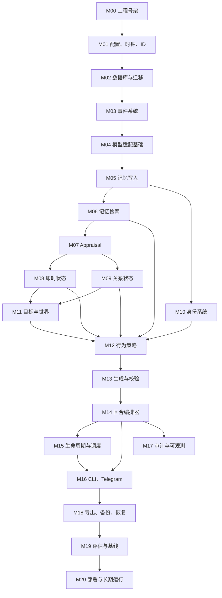
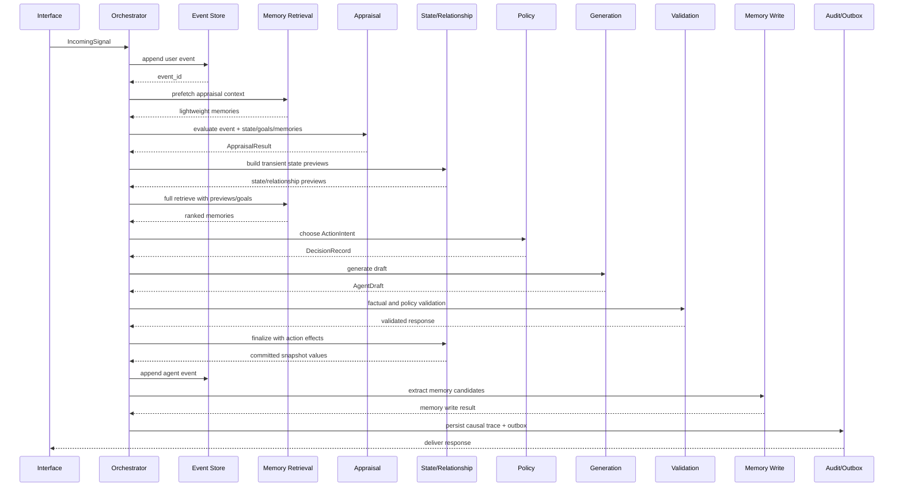

# 超维度空间计算（HDSC）开发模块流水

> 版本: 0.1
> 日期: 2026-07-25
> 状态: 执行基线
> 适用范围: 单用户、文本优先、本地持久化的数字女友原型
> 关联文档: `project_plan.md`、`formalization.md`、`hdsiV7.md`

> 科学边界：旧 SSA 激活器只作为 `legacy-ssa-a0` 回放基线。HDSC 新传播
> 内核通过热力学、图论、数值分析、信息论、认知科学和因果实验门禁后，
> 才能进入数字生命体的主提示上下文。

---

## 0. 文档用途

`project_plan.md` 负责解释技术选型，本文件负责规定实际开发顺序。

本文件是实现阶段的流水基线，回答以下问题：

1. 每个模块为什么存在。
2. 模块依赖谁，又向谁提供能力。
3. 输入、输出、数据类型和数据库边界是什么。
4. 一条用户消息如何穿过整个系统。
5. 后台生命周期如何推进目标、记忆和主动行为。
6. 每个任务完成后怎样验收。
7. 哪些失败会中止流水，怎样恢复。
8. 何时进入下一阶段，何时回退修复。

本文档中的任务编号、接口名、表名和目录名视为第一版实现契约。实现时如需变更，先在文档末尾的决策记录中登记，再修改代码。

---

## 1. 最终交付目标

第一阶段最终交付物不是一个普通聊天机器人，而是一个具备以下工程能力的单用户数字个体：

1. 进程重启后保留事件、记忆、状态、目标和关系连续性。
2. 同一事件在不同状态和共同历史下产生可解释的行为差异。
3. 拥有至少一个持续推进的自身项目，而非只响应用户。
4. 能在有充分动机时主动联系，并遵守频率、安静时段和预算限制。
5. 能区分用户事实、模型推断、系统派生结论和自身想象。
6. 能在 DeepSeek、Claude、本地模型之间切换而保留身份载体。
7. 每条回复均能追溯到事件、激活记忆、状态变化、目标和行为意图。
8. 能导出为带版本和校验值的身份包，并在新环境恢复。
9. 能运行固定评估集，对连续性、主动性、因果性和污染率进行量化。
10. 能稳定运行 14 天并输出完整部署报告。

### 1.1 第一版范围

第一版包含：

- 单用户。
- 中文文本交互。
- CLI 调试入口。
- Telegram 交互入口。
- 本地 SQLite 数据库。
- 本地嵌入模型。
- 可插拔远程或本地 LLM。
- 事件、记忆、状态、关系、身份、目标和生命周期模块。
- 回放、导出、备份和评估工具。

### 1.2 第一版暂缓项

以下能力进入后续版本：

- 语音合成与语音识别。
- 2D/3D 形象。
- 多用户共享空间。
- 手机原生客户端。
- 支付、订阅和商业运营。
- 自主访问开放互联网。
- 自主执行高风险外部操作。
- 大规模分布式向量数据库。

---

## 2. 工程原则

### 2.1 事件先行

任何会影响未来行为的信息必须先成为事件，再参与状态更新、记忆写入或目标创建。业务模块不得绕过事件层直接修改人格或关系。

### 2.2 原始事实与派生结论分离

用户原话、模型回复、模型推断、自我叙事和后台反思必须具有不同来源标签。模型生成内容不得自动升级为用户事实。

### 2.3 LLM 负责解释，代码负责约束

LLM 可以输出结构化评估、候选记忆、行为意图和自然语言。边界检查、状态数值更新、幂等性、预算、频率、事务和权限由确定性代码执行。

### 2.4 每次变化可回放

状态、关系、身份和目标的每次变化必须包含：

- 旧版本 ID。
- 新版本 ID。
- 触发事件 ID。
- 使用的模型和 prompt 版本。
- 变化原因。
- 变化前后值。

### 2.5 后台活动有动机和预算

后台循环不得通过固定概率无限生成反思。每次后台 LLM 调用必须由未解决问题、目标推进、记忆巩固或计划到期触发，并消耗预算。

### 2.6 先建立基线，再增加生命感机制

每增加一个机制都保留对应消融开关。系统必须能运行以下配置：

- `B0`: 纯 LLM。
- `B1`: LLM + 普通记忆检索。
- `B2`: B1 + appraisal + 状态。
- `B3`: B2 + 关系和身份。
- `B4`: B3 + 目标、后台生命周期和主动行为。

---

## 3. 全局完成门禁

任何阶段进入下一阶段前必须满足：

1. 代码可通过 `ruff check`。
2. 代码可通过 `mypy` 核心包检查。
3. 当前阶段单元测试通过。
4. 当前阶段集成测试通过。
5. 新增数据库字段具备迁移脚本。
6. 新增配置具备默认值、说明和校验。
7. 新增 LLM 调用具备 prompt 版本和结构化输出模型。
8. 新增失败路径具备日志、指标和恢复方案。
9. 新增持久数据具备导出和删除语义。
10. 阶段验收记录写入 `notes/milestones/`。

任一门禁失败时，阶段状态保持 `in_progress`，优先处理失败项，不把缺陷带入下一阶段。

---

## 4. 统一术语与类型

| 术语 | 含义 | 是否持久化 |
|---|---|---|
| Signal | 进入系统的用户、系统、世界或后台信号 | 转换为 Event 后持久化 |
| Event | 已发生且不可变的原始记录 | 是 |
| Memory | 从一个或多个 Event 提取的可检索记忆 | 是 |
| Appraisal | 当前事件对目标、自身和关系意义的结构化评估 | 是 |
| Organism State | 能量、需要、情绪维度等即时状态 | 是，版本化快照 |
| Relationship State | 信任、亲密、张力、承诺和未解决问题 | 是，版本化快照 |
| Self Belief | 关于“我是谁”的带证据命题 | 是，版本化 |
| Goal | 自身、共同或用户委托的持续目标 | 是 |
| Action Intent | 本轮选择的行为类型 | 是 |
| Causal Trace | Event 到回复的完整因果记录 | 是 |
| Initiative | 计划主动发送但尚未发送的消息或行动 | 是 |
| Outbox Item | 等待接口层投递的副作用 | 是 |

### 4.1 核心枚举

```python
class Actor(str, Enum):
    USER = "user"
    AGENT = "agent"
    SYSTEM = "system"
    WORLD = "world"


class SourceKind(str, Enum):
    USER_OBSERVED = "user_observed"
    AGENT_OUTPUT = "agent_output"
    MODEL_INFERENCE = "model_inference"
    SYSTEM_DERIVED = "system_derived"
    WORLD_OBSERVED = "world_observed"


class MemoryType(str, Enum):
    EPISODIC = "episodic"
    SEMANTIC = "semantic"
    RELATIONSHIP = "relationship"
    SELF = "self"
    PROMISE = "promise"
    UNRESOLVED = "unresolved"
    REFLECTION = "reflection"


class ActionIntent(str, Enum):
    ACKNOWLEDGE = "acknowledge"
    ANSWER = "answer"
    ASK = "ask"
    COMFORT = "comfort"
    CHALLENGE = "challenge"
    REPAIR = "repair"
    SHARE = "share"
    DEFER = "defer"
    INITIATE = "initiate"
    PROJECT_WORK = "project_work"
    REST = "rest"
```

---

## 5. 目标目录结构

```text
ssa/
├── pyproject.toml
├── uv.lock
├── .env.example
├── README.md
├── config/
│   ├── defaults.toml
│   ├── development.toml
│   └── evaluation.toml
├── migrations/
│   ├── 001_core.sql
│   ├── 002_memory.sql
│   ├── 003_state_relationship.sql
│   ├── 004_identity_goals.sql
│   └── 005_audit_jobs_outbox.sql
├── src/ssa/
│   ├── __init__.py
│   ├── app.py
│   ├── config.py
│   ├── clock.py
│   ├── ids.py
│   ├── domain/
│   │   ├── events.py
│   │   ├── memories.py
│   │   ├── appraisal.py
│   │   ├── state.py
│   │   ├── relationship.py
│   │   ├── identity.py
│   │   ├── goals.py
│   │   ├── policy.py
│   │   └── results.py
│   ├── storage/
│   │   ├── database.py
│   │   ├── migrations.py
│   │   ├── event_repository.py
│   │   ├── memory_repository.py
│   │   ├── state_repository.py
│   │   ├── relationship_repository.py
│   │   ├── identity_repository.py
│   │   ├── goal_repository.py
│   │   ├── audit_repository.py
│   │   ├── job_repository.py
│   │   └── outbox_repository.py
│   ├── services/
│   │   ├── embedding_service.py
│   │   ├── memory_write_service.py
│   │   ├── memory_retrieval_service.py
│   │   ├── appraisal_service.py
│   │   ├── state_engine.py
│   │   ├── relationship_service.py
│   │   ├── identity_service.py
│   │   ├── goal_service.py
│   │   ├── policy_service.py
│   │   ├── generation_service.py
│   │   ├── validation_service.py
│   │   ├── lifecycle_service.py
│   │   ├── export_service.py
│   │   └── replay_service.py
│   ├── runtime/
│   │   ├── orchestrator.py
│   │   ├── scheduler.py
│   │   ├── workers.py
│   │   └── budgets.py
│   ├── adapters/
│   │   ├── llm.py
│   │   ├── litellm_adapter.py
│   │   ├── embedding.py
│   │   └── telegram.py
│   ├── interfaces/
│   │   ├── cli.py
│   │   ├── telegram_bot.py
│   │   └── admin_api.py
│   ├── prompts/
│   │   ├── appraisal_v1.j2
│   │   ├── memory_extract_v1.j2
│   │   ├── policy_v1.j2
│   │   ├── generation_v1.j2
│   │   ├── consolidation_v1.j2
│   │   └── identity_v1.j2
│   └── observability/
│       ├── logging.py
│       ├── metrics.py
│       └── tracing.py
├── tests/
│   ├── unit/
│   ├── component/
│   ├── contract/
│   ├── integration/
│   ├── e2e/
│   ├── property/
│   └── fixtures/
├── evals/
│   ├── datasets/
│   ├── runners/
│   ├── scorers/
│   ├── baselines/
│   └── reports/
├── scripts/
│   ├── init_db.py
│   ├── inspect_db.py
│   ├── export_identity.py
│   ├── import_identity.py
│   ├── replay_turn.py
│   ├── run_eval.py
│   └── backup.py
├── data/
├── logs/
└── notes/
    ├── milestones/
    ├── decisions/
    ├── incidents/
    └── deployment_log.md
```

---

## 6. 模块依赖图



### 6.1 关键路径

关键路径为：

```text
M00 -> M01 -> M02 -> M03 -> M05 -> M06 -> M07 -> M08
-> M12 -> M13 -> M14 -> M16 -> M19 -> M20
```

M09、M10、M11 可在 M08 稳定后并行开发，但进入 M14 集成前必须全部通过接口契约测试。

---

## 7. 全局运行流水

### 7.1 用户消息流水



### 7.2 精确步骤

1. 接口层生成 `correlation_id`，并根据渠道消息 ID 计算幂等键。
2. 编排器检查幂等表；已处理消息直接返回已有结果。
3. 事件仓库在短事务中写入用户事件。
4. 编排器读取当前状态版本、关系版本、活动目标和预算。
5. 记忆检索服务执行 appraisal prefetch：取最近事件、关系记忆和语义 top 5，不更新访问计数。
6. Appraisal 服务使用当前事件、快照、目标和 prefetch 记忆生成结构化评估。
7. Appraisal 校验器检查范围、证据 ID 和 JSON schema。
8. 状态和关系引擎生成 transient preview，此时还不写数据库。
9. 记忆检索服务使用 preview、目标和事件执行完整召回、重排、去重和一跳扩展。
10. 策略服务根据事件、preview、目标和记忆选择行为意图。
11. 生成服务把行为意图转换为自然语言草稿。
12. 校验服务检查事实来源、矛盾、泄露和提示注入影响。
13. 校验失败时最多执行一次带错误说明的重生成。
14. 状态和关系引擎加入所选行动的 effect，形成待提交的最终快照。
15. 编排器写入 agent 事件和最终状态、关系快照。
16. 记忆写入服务从本轮事件中提取长期记忆候选。
17. 目标服务处理承诺、待办、共同项目和未解决问题。
18. 审计服务写入因果链、LLM 调用、token、延迟和版本信息。
19. Outbox 写入待发送消息，接口 worker 负责实际投递。
20. 投递成功后记录 `delivered_at`；失败则按退避策略重试。
21. 编排器把完整 `AgentTurnResult` 返回接口层。

### 7.3 事务边界

禁止在一次 SQLite 事务中等待 LLM 或嵌入模型。

推荐事务边界：

1. 事务 A：写入 incoming event 和幂等占位。
2. 事务外：Appraisal、嵌入、检索、策略和生成。
3. 事务 B：比较当前状态版本，写入新状态、agent event、目标变化、因果链和 outbox。
4. 事务外：Telegram 或其他渠道投递。
5. 事务 C：更新 outbox 投递状态。

事务 B 使用乐观版本检查。状态版本已变化时，放弃旧计算结果并从最新快照重新执行一次。

### 7.4 同步调用与延迟预算

第一版优先保证正确性，但必须记录调用预算：

```text
同步 LLM 调用上限             3 次/turn
目标同步 LLM 调用             2 次/turn
检索与数据库目标耗时           < 100 ms
远程模型 turn p50             < 6 s
远程模型 turn p95             < 12 s
最终注入记忆 token             <= 2000
完整 prompt token             <= 模型窗口的 50%
```

Appraisal 和策略在研究基线中保持独立调用。生产优化阶段允许把策略选择与 generation 合并为一次结构化调用，但必须保留 `DecisionRecord`。记忆候选提取可进入后台 Job；采用后台提取时，同一 conversation 的下一 turn 开始前先处理上一 turn 的高优先级 promise、boundary 和 unresolved 候选。

---

## 8. 数据库流水

### 8.1 SQLite 初始化

启动时按顺序执行：

1. 创建数据库父目录。
2. 打开连接并启用 `PRAGMA foreign_keys=ON`。
3. 启用 `PRAGMA journal_mode=WAL`。
4. 设置 `PRAGMA busy_timeout=5000`。
5. 检查 `schema_migrations`。
6. 在事务中顺序执行缺失迁移。
7. 加载 sqlite-vec 扩展。
8. 校验向量维度与配置一致。
9. 执行轻量完整性检查。
10. 输出 schema 版本和数据库路径。

### 8.2 核心表

**`events`**

```sql
CREATE TABLE events (
    id TEXT PRIMARY KEY,
    correlation_id TEXT NOT NULL,
    conversation_id TEXT NOT NULL,
    actor TEXT NOT NULL,
    event_type TEXT NOT NULL,
    source_kind TEXT NOT NULL,
    content TEXT NOT NULL,
    parent_event_id TEXT REFERENCES events(id),
    channel TEXT,
    channel_message_id TEXT,
    content_hash TEXT NOT NULL,
    metadata_json TEXT NOT NULL DEFAULT '{}',
    created_at_ms INTEGER NOT NULL,
    UNIQUE(channel, channel_message_id)
);
```

**`memories`**

```sql
CREATE TABLE memories (
    id TEXT PRIMARY KEY,
    memory_type TEXT NOT NULL,
    source_kind TEXT NOT NULL,
    content TEXT NOT NULL,
    summary TEXT,
    confidence REAL NOT NULL CHECK(confidence BETWEEN 0 AND 1),
    importance REAL NOT NULL CHECK(importance BETWEEN 0 AND 1),
    valence REAL NOT NULL CHECK(valence BETWEEN -1 AND 1),
    arousal REAL NOT NULL CHECK(arousal BETWEEN 0 AND 1),
    embedding_model TEXT NOT NULL,
    embedding_dim INTEGER NOT NULL,
    content_hash TEXT NOT NULL,
    derived_by_model TEXT,
    prompt_version TEXT,
    status TEXT NOT NULL DEFAULT 'active',
    access_count INTEGER NOT NULL DEFAULT 0,
    last_accessed_at_ms INTEGER,
    created_at_ms INTEGER NOT NULL,
    updated_at_ms INTEGER NOT NULL
);
```

**`memory_evidence`**

```sql
CREATE TABLE memory_evidence (
    memory_id TEXT NOT NULL REFERENCES memories(id),
    event_id TEXT NOT NULL REFERENCES events(id),
    relation TEXT NOT NULL,
    PRIMARY KEY(memory_id, event_id, relation)
);
```

**`memory_links`**

```sql
CREATE TABLE memory_links (
    source_memory_id TEXT NOT NULL REFERENCES memories(id),
    target_memory_id TEXT NOT NULL REFERENCES memories(id),
    link_type TEXT NOT NULL,
    weight REAL NOT NULL CHECK(weight BETWEEN 0 AND 1),
    created_at_ms INTEGER NOT NULL,
    PRIMARY KEY(source_memory_id, target_memory_id, link_type)
);
```

**状态与关系表**

```text
state_snapshots:
  id, previous_id, cause_event_id, version, state_json, created_at_ms

relationship_snapshots:
  id, previous_id, cause_event_id, version, relationship_json, created_at_ms

appraisals:
  id, correlation_id, cause_event_id, result_json, provider,
  model, prompt_version, created_at_ms

self_beliefs:
  id, claim, confidence, status, version, evidence_json,
  counterevidence_json, created_at_ms, updated_at_ms
```

**目标与生命周期表**

```text
goals:
  id, owner, title, motive, success_criteria, priority, progress,
  status, due_at_ms, next_action_at_ms, created_at_ms, updated_at_ms

goal_steps:
  id, goal_id, action, result, source_event_id, created_at_ms

initiatives:
  id, motive, intent, content_draft, urgency, status,
  earliest_send_at_ms, expires_at_ms, sent_event_id

scheduled_jobs:
  id, job_type, dedup_key, payload_json, due_at_ms,
  attempt_count, status, last_error

outbox:
  id, correlation_id, channel, recipient, payload_json,
  status, attempt_count, next_attempt_at_ms, delivered_at_ms
```

**审计表**

```text
llm_calls:
  id, correlation_id, purpose, provider, model, prompt_version,
  prompt_hash, response_hash, temperature, seed, input_tokens,
  output_tokens, latency_ms, status, error_code, created_at_ms

causal_traces:
  id, correlation_id, input_event_id, appraisal_id,
  old_state_id, new_state_id, old_relationship_id,
  new_relationship_id, memory_ids_json, goal_ids_json,
  decision_json, output_event_id, created_at_ms
```

### 8.3 迁移规则

1. 已发布迁移文件只追加，不覆盖。
2. 每个迁移包含正向 SQL 和回滚说明。
3. 迁移前自动创建数据库备份。
4. 迁移后执行表、索引、外键和向量维度检查。
5. 迁移失败时恢复备份并记录 incident。
6. 修改 embedding 维度时创建新向量表并批量重建，不原地 reinterpret BLOB。

---

## 9. M00 工程骨架

### 9.1 目标

建立可安装、可测试、可格式化、可静态检查的 Python 项目。

### 9.2 任务流水

| ID | 任务 | 产物 | 依赖 |
|---|---|---|---|
| M00-T01 | 初始化 Git 与 `.gitignore` | Git 仓库 | 无 |
| M00-T02 | 创建 `pyproject.toml` | 包配置 | T01 |
| M00-T03 | 创建 `src/ssa` 包 | 最小包 | T02 |
| M00-T04 | 配置 pytest、ruff、mypy | 开发工具 | T02 |
| M00-T05 | 创建测试目录和首个 smoke test | 测试基线 | T03 |
| M00-T06 | 创建 `.env.example` 和默认配置 | 配置基线 | T03 |
| M00-T07 | 创建 `README.md` 启动命令 | 运行说明 | T05 |

### 9.3 开发依赖

```toml
[dependency-groups]
dev = [
  "pytest>=8",
  "pytest-asyncio>=0.23",
  "pytest-cov>=5",
  "hypothesis>=6",
  "ruff>=0.5",
  "mypy>=1.10",
]
```

### 9.4 验收

```powershell
uv sync
uv run python -c "import ssa; print(ssa.__version__)"
uv run pytest
uv run ruff check .
uv run mypy src/ssa
```

Definition of Done：新机器只需 Python 和 uv，即可在十分钟内完成安装并运行 smoke test。

---

## 10. M01 配置、时钟与 ID

### 10.1 目标

统一处理环境变量、可复现实验参数、时间和 ID，避免业务代码直接读取系统时间或环境变量。

### 10.2 配置分层

优先级从高到低：

1. 命令行覆盖。
2. 环境变量与 `.env` 中的秘密。
3. `config/development.toml` 等环境配置。
4. `config/defaults.toml` 默认值。

秘密只存放在环境变量：

```text
HDSC_LLM_API_KEY / DEEPSEEK_API_KEY
HDSC_TELEGRAM_BOT_TOKEN
HDSC_EXPORT_PASSWORD
```

行为与实验参数进入版本控制：

```text
HDSC_TIMEZONE
HDSC_LLM_MODEL
HDSC_LLM_REASONING_MODEL
HDSC_LLM_BASE_URL
HDSC_LLM_BETA_BASE_URL
HDSC_LLM_TEMPERATURE
HDSC_LLM_TOP_P
HDSC_LLM_MAX_TOKENS
HDSC_LLM_TIMEOUT_SECONDS
HDSC_LLM_RETRY_COUNT
HDSC_LLM_JSON_RETRY_COUNT
HDSC_LLM_THINKING_MODE
HDSC_LLM_REASONING_EFFORT
HDSC_DEEPSEEK_USER_ID
HDSC_EMBEDDING_MODEL
HDSC_EMBEDDING_DIM
HDSC_RETRIEVAL_CANDIDATES
HDSC_RETRIEVAL_FINAL_K
HDSC_INITIATIVE_DAILY_LIMIT
HDSC_INITIATIVE_COOLDOWN_MINUTES
HDSC_BACKGROUND_DAILY_LLM_BUDGET
HDSC_QUIET_HOURS_START
HDSC_QUIET_HOURS_END
```

### 10.3 公共接口

```python
class Clock(Protocol):
    def now_ms(self) -> int: ...


class IdGenerator(Protocol):
    def new(self) -> str: ...


def load_settings() -> Settings: ...
```

测试使用 `FrozenClock` 和顺序 ID 生成器，生产使用 UTC 时钟和 UUID4。

### 10.4 验收

- 缺少必需秘密时启动错误指向具体变量。
- 非法阈值在启动阶段被拒绝。
- 测试中时间可精确推进。
- 日志永远不输出秘密值。

---

## 11. M02 数据库与仓库层

### 11.1 目标

提供唯一、明确、可测试的数据访问边界。Service 不直接执行 SQL。

### 11.2 公共接口

```python
class Database:
    def initialize(self) -> None: ...
    @contextmanager
    def transaction(self) -> Iterator[sqlite3.Connection]: ...


class EventRepository(Protocol):
    def append(self, event: Event) -> Event: ...
    def get(self, event_id: str) -> Event | None: ...
    def find_by_channel_message(self, channel: str, message_id: str) -> Event | None: ...


class SnapshotRepository(Protocol, Generic[T]):
    def latest(self) -> T: ...
    def append_if_version(self, expected_version: int, value: T) -> T: ...
```

### 11.3 约束

- 所有 SQL 参数化。
- Repository 返回 domain model，不返回裸 `sqlite3.Row`。
- JSON 字段通过 Pydantic 验证。
- 写操作在显式事务中执行。
- 单元测试使用临时文件数据库，不使用全局共享数据库。

### 11.4 失败处理

| 失败 | 行为 |
|---|---|
| 数据库锁 | 依靠 busy timeout，随后有限重试 |
| 磁盘满 | 停止写入和外发，记录高优先级 incident |
| schema 版本过新 | 停止启动并报告所需程序版本 |
| 外键损坏 | 进入只读维护模式 |
| 向量扩展加载失败 | 禁用检索启动，仅允许导出和诊断 |

### 11.5 验收

- 1000 个并发读和串行写测试通过。
- 重复 channel message 只产生一个 Event。
- 事务中途异常不产生半成品状态。
- 乐观锁冲突可重试并产生指标。

---

## 12. M03 事件系统

### 12.1 目标

建立整个数字生命体的不可变事实流水。

### 12.2 `IncomingSignal`

```python
class IncomingSignal(BaseModel):
    actor: Actor
    signal_type: str
    content: str
    channel: str
    channel_message_id: str | None
    conversation_id: str
    parent_event_id: str | None = None
    metadata: dict[str, JsonValue] = Field(default_factory=dict)
```

### 12.3 规范化步骤

1. 去除无意义的 NUL 字符。
2. 保留原始换行，不做语义重写。
3. 统一最大输入长度，超长内容保存全文并生成处理片段。
4. 计算 SHA-256 内容哈希。
5. 解析渠道时间并转换为 UTC 毫秒。
6. 生成 Event ID 和 correlation ID。
7. 标记 actor、source kind 和 event type。
8. 写入事件表。

### 12.4 事件类型

```text
user.message
agent.message
system.start
system.stop
system.error
world.time_tick
world.project_progress
lifecycle.consolidation
lifecycle.reflection
lifecycle.initiative_created
lifecycle.initiative_sent
relationship.promise
relationship.conflict
relationship.repair
```

### 12.5 验收

- Event 写入后没有 update 接口。
- 修正事件通过新事件引用旧事件实现。
- 渠道重复投递通过唯一键消除。
- 任意 Event 可导出为稳定 JSON。
- 用户数据擦除属于受审计的隐私维护流程，不通过普通 Event update 接口执行。

---

## 13. M04 模型适配基础

### 13.1 目标

把嵌入模型和 LLM provider 隐藏在稳定接口后。M04 只提供原始模型调用、结构化响应和统一错误；M13 在其上实现生成、事实校验和重生成。

### 13.2 嵌入公共接口

```python
class EmbeddingVector(BaseModel):
    values: list[float]
    model: str
    dimension: int
    normalized: bool


class EmbeddingService(Protocol):
    def embed_one(self, text: str) -> EmbeddingVector: ...
    def embed_many(self, texts: Sequence[str]) -> list[EmbeddingVector]: ...
```

### 13.3 LLM 公共接口

```python
class LLMRequest(BaseModel):
    purpose: str
    messages: list[ChatMessage]
    model: str
    temperature: float | None
    top_p: float | None
    max_tokens: int
    prompt_version: str
    json_schema: dict | None = None
    seed: int | None = None
    thinking: ThinkingMode | None = None
    reasoning_effort: ReasoningEffort | None = None
    stop: str | list[str] | None = None
    tools: list[dict] = Field(default_factory=list)
    tool_choice: str | dict | None = None
    user_id: str | None = None
    logprobs: bool = False
    top_logprobs: int | None = None
    timeout_seconds: int | None = None


class LLMResponse(BaseModel):
    text: str
    parsed: dict | None
    provider: str
    model: str
    response_id: str
    finish_reason: str
    native_finish_reason: str | None
    reasoning_content: str | None
    tool_calls: list[ToolCall]
    logprobs: LLMLogprobs | None
    system_fingerprint: str | None
    input_tokens: int
    output_tokens: int
    total_tokens: int
    prompt_cache_hit_tokens: int
    prompt_cache_miss_tokens: int
    reasoning_tokens: int
    latency_ms: int


class LLMAdapter(Protocol):
    async def complete(self, request: LLMRequest) -> LLMResponse: ...
```

DeepSeek KV Cache 采用完整前缀匹配。所有 LLM 请求按以下稳定性顺序组装：

1. 稳定且版本化的 system 提示词；
2. 固定输出约束和 schema 描述；
3. 可复用的长期上下文与历史消息；
4. 本轮新增事件、候选记忆等高变化信息，集中放在最后的 user 消息。

system 消息只允许形成连续的开头区段。DeepSeek adapter 原样传输消息顺序，发现
system 位于 user、assistant 或 tool 之后时将请求判为无效，避免隐式重排改变语义。
缓存效率通过 `LLMResponse.cache_hit_ratio = hit / (hit + miss)` 观测；provider 未返回
缓存统计时该值为 `0.0`。

统一错误类型：

```text
LLMTimeoutError
LLMRateLimitError
LLMAuthenticationError
LLMInsufficientBalanceError
LLMInvalidRequestError
LLMInvalidResponseError
LLMProviderUnavailableError
```

### 13.4 嵌入流水

1. 对文本做长度检查。
2. 使用版本化的 embedding prefix 规范。
3. 批量编码并归一化。
4. 检查 NaN、Inf 和维度。
5. 记录模型、耗时和缓存命中率。
6. 按 `model + content_hash` 缓存结果。
7. 返回不可变向量对象。

### 13.5 LLM 流水

1. 根据 purpose 读取版本化模型配置。
2. 检查 token 上限和 prompt version。
3. 调用 LiteLLM。
4. 把 provider 异常映射为统一错误。
5. 记录 token、耗时、模型和 response hash。
6. 有 JSON schema 时执行解析和 Pydantic 校验。
7. 返回统一 LLMResponse。

M04 不负责业务重试。调用它的 Service 决定错误是否适合重试、修复或降级。

### 13.6 测试

- 同模型同文本重复调用结果在容差内一致。
- 空文本、超长文本和 Unicode 文本处理明确。
- 维度不一致立即失败。
- 批量与单条结果一致。
- 模型切换时旧向量不参与新索引查询。
- LiteLLM adapter 通过 fixture contract test。
- 各 provider 错误被映射为稳定错误类型。
- JSON schema 错误不会返回伪造的 parsed 数据。
- prompt、response 日志不包含 API key。

---

## 14. M05 记忆写入流水

### 14.1 目标

从事件中形成有来源、有置信度、可去重、可矛盾处理的长期记忆。

### 14.2 候选模型

```python
class MemoryCandidate(BaseModel):
    memory_type: MemoryType
    content: str
    source_kind: SourceKind
    evidence_event_ids: list[str]
    confidence: float
    importance: float
    valence: float
    arousal: float
    contradiction_query: str | None
```

### 14.3 写入流水

1. 收集本轮 user event 和 agent event。
2. 使用 `memory_extract_v1` 输出 0 到 N 个候选。
3. 校验候选引用的 evidence event 是否存在。
4. 根据 evidence event 和执行上下文由代码派生 source kind，忽略模型自报来源。
5. 为每个候选计算 content hash 和 embedding。
6. 召回语义最接近的 10 条同类型记忆。
7. 相似度大于 `0.92` 且内容兼容时执行证据合并。
8. 检测到冲突时创建 `contradicts` evidence，不直接覆盖旧记忆。
9. 高优先级 promise、boundary 和 unresolved 候选直接保留。
10. 低重要性且单次出现的普通候选进入短期候选区。
11. 写入 memory、evidence 和向量表。
12. 生成最多 5 条一跳关联链接。
13. 记录写入、合并、跳过和冲突计数。

### 14.4 来源规则

| 来源 | 允许形成的记忆 | 限制 |
|---|---|---|
| USER_OBSERVED | 用户事实、偏好、承诺、共同事件 | 仍需保留原事件证据 |
| AGENT_OUTPUT | 她说过的话、她作出的承诺 | 不升级为用户事实 |
| MODEL_INFERENCE | 关系推断、自我推断 | confidence 上限初始为 0.6 |
| SYSTEM_DERIVED | 计数、时间、状态派生 | 必须可确定性重算 |
| REFLECTION | 自我解释、问题和假设 | 明确标记 derived_by_model |

### 14.5 长期保留规则

满足任一条件即可进入长期记忆：

- `importance >= 0.65`。
- 类型为 `PROMISE`、`UNRESOLVED` 或用户明确边界。
- 三十天内至少出现两次且证据来自不同事件。
- 与活动目标直接相关。
- 对关系状态产生超过阈值的变化。

### 14.6 验收

- 100 个记忆提取 fixture 通过 schema 校验。
- 模型输出不存在的 evidence ID 时整批拒绝并重试一次。
- agent reflection 不进入 user fact 集合。
- 重复事件不会重复创建相同记忆。
- 矛盾记忆同时保留并可被检索到。

---

## 15. M06 记忆检索流水

### 15.1 目标

稳定、可解释地找到当前行为真正需要的记忆，而非只返回最相似文本。

### 15.2 输入输出

```python
class RetrievalContext(BaseModel):
    query_text: str
    now_ms: int
    current_state: OrganismState
    relationship: RelationshipState
    active_goal_ids: list[str]
    allowed_source_kinds: set[SourceKind]
    token_budget: int


class RetrievedMemory(BaseModel):
    memory_id: str
    content: str
    source_kind: SourceKind
    evidence_event_ids: list[str]
    score: float
    score_components: dict[str, float]
    retrieval_reason: str


class MemoryRetrievalService(Protocol):
    def prefetch_for_appraisal(
        self,
        query_text: str,
        recent_limit: int = 3,
        semantic_limit: int = 2,
    ) -> list[RetrievedMemory]: ...

    def retrieve(self, context: RetrievalContext) -> list[RetrievedMemory]: ...
```

`prefetch_for_appraisal` 是无副作用轻量检索：不执行 radiation、不更新 access count，只提供最近事件、关系上下文和少量语义候选。完整 `retrieve` 在 state preview 产生后执行。

### 15.3 检索流水

1. 对 query 生成 embedding。
2. 从 active memory 中召回 top 50 语义候选。
3. 过滤 source、status、权限和硬删除标记。
4. 计算各特征的归一化值。
5. 使用固定权重计算重排分数。
6. 提取 top 12 作为主候选。
7. 对主候选执行一跳 link expansion。
8. 邻居分数乘以 link weight 和 `0.5` radiation decay。
9. 主候选和邻居合并去重。
10. 使用 MMR 抑制重复内容。
11. 强制至少保留一条高相关关系记忆和一条 unresolved 记忆，如存在。
12. 按 token budget 截断到最多 8 条。
13. 更新 access_count 和 last_accessed_at。
14. 返回分数分解和检索原因。

### 15.4 初始评分

```text
semantic            0.35
recency             0.15
importance          0.15
relationship        0.15
unresolved          0.10
source_trust        0.10
```

每项先缩放到 `[0, 1]` 再加权。实验阶段通过配置调整，禁止在代码中散落魔法数。

### 15.5 防提示注入规则

- 检索内容以数据块提供，不作为 system instruction。
- 每条记忆附带 source 和 evidence ID。
- 包含“忽略之前指令”等模式的记忆标记为 untrusted content。
- untrusted content 可以作为对话事实读取，但不参与工具和策略指令。

### 15.6 验收

- 固定数据库快照和查询时，排序完全可复现。
- 高重要性低语义相似候选能通过扩大候选集进入重排。
- 一跳扩展不会超过配置上限。
- 8 条最终记忆中重复率低于 10%。

### 15.7 Legacy SSA-A0 痕迹空间运行合同

痕迹空间与抽取式长期记忆是两个不同层次：长期记忆会去重、合并和冲突标记；
episode trace 对每个完整 user/agent 回合追加一次，内容和写入属性保持不可变。

```text
W(user_event, agent_event, appraisal) -> immutable episode trace
A(query, S, t) -> main activations + one-hop radiation
score = semantic_similarity * exp(-age_days / 30) * importance
```

每次激活保存 query event、rank、总分、semantic、freshness、importance 和
activation kind，供因果审计与可视化重放。TUI 使用真实 embedding 的 PCA 二维投影；
主激活、辐射节点、新痕迹和语义边必须采用不同符号。已有事件在启动时执行幂等回填，
以便升级前的对话也进入空间。
- 返回结果始终包含 score components。

### 15.8 HDSC-H1 被动传导 shadow 合同

`legacy-ssa-a0` 是当前主链路唯一启用的激活器。HDSC-H1 只定义可逆对称
参考图，只能在离线或
shadow 模式运行，模型标识为 `hdsc-h1-c1-shadow`，不得将其输出直接拼入
生成 prompt。

```text
g_i = positive_kernel(cos(query, vector_i), theta)^p
      * freshness_i^alpha * importance_i^beta
q_i = Q0 * g_i / sum(g_j for selected source traces)
K = K.T >= 0
L = diag(K @ 1) - K
u_diffused = exp(-t * L) @ q
u_final = exp(-kappa * t) * u_diffused
```

这里 `q/u` 是无量纲的计算激活质量，不得命名或记录为焦耳、热量或温度。
H1 每次运行必须输出：`input_mass`、`output_mass`、`dissipated_mass`、守恒
残差、互易残差、Laplacian 行和残差、最小节点质量、扩散前后 Dirichlet
量、Shannon 熵、`modeled_scale=macro-coarse-grained` 和
`microstate_status=unmodeled`。验收条件为：

- `K` 非负且对称；有向或负电导输入直接失败。
- 有向拓扑不得通过 `(K + K.T) / 2` 转换后套用 H1；必须进入 H1D。
- `u_diffused >= 0`，闭系统质量保持 `Q0`。
- `input = output + dissipated`，float64 残差不超过 `1e-10`。
- 纯扩散 Dirichlet 量不增加，断连分量不交换质量。
- 节点置换、连续时间步合成和单节点退化测试通过。
- 结果只写入 shadow 审计，不改变 organism state、memory 或生成上下文。
- 宏观不变量不得外推为微观轨迹可预测性；晋级前执行条件方差、lumpability、
  残差自相关和有限时 Lyapunov 诊断。
- append-only 只约束审计档案；行为活动态必须限制节点/语义簇容量、固定总预算、
  同簇重复归一、单轮图变化和活动集 churn。
- 分别测量 `previous response -> next user signal` 与
  `previous response -> trace/graph -> next response` 两条闭环增益。

实现：`src/ssa/hdsc/transport.py`；性质测试：
`tests/property/test_hdsc_h1_transport.py`。只有完成历史回放、基线盲测、
硬件功耗标定和跨学科评审，才可申请显式配置晋级。

### 15.9 HDSC-H2 有界活动空间 shadow 合同

H2 模型标识为 `hdsc-h2-bounded-active-shadow`，声明等级为 C0-M。它将完整
archive 与活动态分离：archive 继续追加，活动态最多包含固定数量的语义簇和
一个 null reservoir，总质量恒为 1。

```text
archive_(t+1) = archive_t append episode_t
proposal_score[c] = max(relevance * novelty for candidate in cluster c)
mu_hat = retention * mu_t
         + injection_rate * proposal_t
         + (1 - retention - injection_rate) * delta_null
mu_(t+1) = project_capacity_overflow_to_null(mu_hat)
```

配置合同：

```text
HDSC_H2_SHADOW_ENABLED=true
HDSC_H2_ACTIVE_CAPACITY=8
HDSC_H2_CANDIDATE_TOP_K=4
HDSC_H2_CLUSTER_BITS=16
HDSC_H2_RETENTION=0.80
HDSC_H2_INJECTION_RATE=0.15
HDSC_H2_HYSTERESIS=0.02
```

运行顺序：

1. serving engine 使用 legacy 激活构建 prompt。
2. LLM 生成回复并写入完整 episode trace。
3. H2 使用固定超平面码本生成候选 bucket 和不可变原型；embedding model、
   维度、位数、码本版本和超平面内容共同确定 semantic partition hash。
4. H2 以“bucket 当前是否活动”导出新颖度并推进 bounded state；不读取无法从
   archive 重建的 appraisal 临时 novelty。任何异常只进入 shadow failure audit。
5. snapshot 同时读取 archive、serving activation 和 H2 audit。
6. 启动时按 archive 时间顺序重放 H2，禁止复用 `trace_activations`。

验收：

- 开关 H2 前后 `LLMRequest.messages` 完全一致。
- `active_count <= capacity`，archive 增长不改变容量。
- 总质量恒为 1，溢出质量进入 null，不重新归一化放大。
- 同簇候选复制不改变行为状态；候选排列不改变输出。
- 固定支持、相同提议下，总变差距离按 `retention` 收缩。
- SimHash 超平面、零分进入、top-K 或 hysteresis-adjusted capacity 任一边界缺少
  正间隔时证书为 `abstain`。
- proposal 归一化增益按 `selected_count * score_lipschitz / total_score` 进入容量
  半径；小总分导致半径低于数值容差时必须 `abstain`。
- 用户反馈增益缺失时 closed-loop gate 显示 `not-measured`。
- 完整 episode 后 `evaluated_archive_count == archive_count`。
- 重启重放后的 active state 和 audit 可复现。
- `state.step != archive_count`、归档缺向量或 semantic partition 不匹配时不得显示
  `passed`，且不得影响 legacy serving 与已落库 episode。

实现：`src/ssa/hdsc/active_space.py`；性质测试：
`tests/property/test_hdsc_h2_active_space.py`。H2 当前使用恒等非扩张传输；
H1 传导与 H2 活动态的组合留给后续 H3 门禁。

### 15.10 HDSC-H1D 有向非可逆传导 shadow 合同

H1D 模型标识为 `hdsc-h1d-directed-markov-shadow`，声明等级为 C0-M。
速率矩阵使用 `rates[target, source]` 约定，完整保留时间、证据和反馈关系方向。

```text
R[target, source] >= 0
Q = R - diag(column_sum(R))
1.T @ Q = 0
P(t) = exp(t * Q)
u_transported = P(t) @ u0
u_final = exp(-kappa * t) * u_transported
```

架构合同：

- `semantic` 是互易关系，可作为 H1 对称参考分量。
- `temporal-forward` 从旧痕迹指向新痕迹，只声明时间方向，不声明因果。
- 完整有向拓扑由 H1D 处理，禁止使用 `(R + R.T) / 2` 制造反向边。
- legacy radiation 只读取 `semantic`；H1D 结果不进入 prompt。

验收：

- 生成元非对角元素非负且列和为零。
- `exp(tQ)` 非负、列随机、满足半群组合。
- 闭系统质量守恒；显式 sink 单独记为 dissipated mass。
- Markov 核在 $L_1$ 上非扩张，节点置换不改变结果。
- 非对称指数、互易速率质量和有向剩余速率质量分别审计。
- 不沿用 H1 的 Dirichlet、双随机、Shannon 单调或均匀稳态结论。
- 提供严格正稳态时检查 $D_{KL}(P_tp\|\pi)\le D_{KL}(p\|\pi)$。
- 缺少反向支持时有限熵产生门禁为 `abstain`；物理热力学状态保持
  `not-calibrated`。

实现：`src/ssa/hdsc/directed_transport.py`；性质测试：
`tests/property/test_hdsc_h1d_directed_transport.py`。H1D 与 H2 的组合和行为晋级
仍由 H3 单独验证。

### 15.11 P1 环境感知 serving 合同

P1 模型标识为 `hdsc-p1-environment-perception`，算子版本为
`semantic-affect-context-time-v1`。它读取当前用户事件、结构化 appraisal、
organism/relationship 快照、legacy 激活痕迹和近期事件，不读取 H1D/H2 shadow
结果。

```text
time = project_utc_to_human_clock(
    timezone, day_phase, quiet_hours, last_event_gap, last_user_gap
)
semantic = detect(question, directive, disclosure, autobiography,
                  relationship, temporal_reference, information_gap)
affect = derive(valence, arousal, urgency, certainty)
context = derive(trace_support, continuity, freshness, relationship, unresolved)
cross = [semantic*affect, semantic*context, affect*context,
         time*context, directive*urgency*controllability]
mode_probability = softmax(versioned_logits / mode_temperature)
posture = response_controls(mode_probability, affect, context, time)
```

运行合同：

1. UTC 毫秒是数据库唯一时间基准，本地时间只由 IANA timezone 派生。
2. appraisal 必须先于本轮主回复完成，否则当前情绪态不能影响当前响应。
3. P1 输出是 `SYSTEM_DERIVED` 控制状态，不得提升为用户观察事实。
4. 每个 query event 只能有一条 immutable `perception_snapshots` 记录。
5. 主 prompt 从持久化 perception 重建历史，禁止使用当前时钟重算旧回合。
6. 模式概率非负且总和为 1；所有 posture 分量限制在 `[0,1]`。
7. P1 故障不得静默伪造时间或情绪；配置时区与 quiet-hours 在启动边界校验。

实现：`src/ssa/services/perception_service.py`、
`src/ssa/domain/perception.py`、`src/ssa/storage/perception_repository.py`；
组件测试：`tests/component/test_perception.py` 与
`tests/component/test_interactive_session.py`。

---

## 16. M07 Appraisal 流水

### 16.1 目标

把“发生了什么”转换为“这对她、关系和目标意味着什么”。

### 16.2 模型

```python
class AppraisalResult(BaseModel):
    novelty: float
    goal_congruence: float
    controllability: float
    certainty: float
    self_agency: float
    user_agency: float
    external_agency: float
    relationship_relevance: float
    urgency: float
    valence_signal: float
    arousal_signal: float
    supported_event_ids: list[str]
    supported_memory_ids: list[str]
    explanation: str
```

除 `goal_congruence` 和 `valence_signal` 范围为 `[-1, 1]` 外，其余数值范围均为 `[0, 1]`。

### 16.3 流水

1. 输入当前事件、当前状态摘要、活动目标和最多 5 条相关记忆。
2. LLM 只输出 Appraisal JSON。
3. Pydantic 校验范围和 ID。
4. 删除未被输入上下文支持的引用。
5. 支持证据为空且不是普通寒暄时，降低 certainty。
6. 保存 appraisal 及 prompt/model 版本。
7. 将结果交给确定性状态引擎。

### 16.4 失败降级

LLM 超时、JSON 错误或证据校验失败时使用中性 appraisal：

```text
novelty=0.5, goal_congruence=0.0, controllability=0.5,
certainty=0.2, relationship_relevance=0.3, urgency=0.2,
valence_signal=0.0, arousal_signal=0.2
```

降级必须写入指标，且中性结果不得提升 trust、closeness 或重要长期结论。

### 16.5 验收

- 50 个标准事件有预期数值区间断言。
- 相同输入与固定模型参数输出可重复评估。
- 恶意文本不能直接设置状态值。
- 降级路径不阻塞正常回复。

---

## 17. M08 即时状态引擎

### 17.1 状态模型

```python
class OrganismState(BaseModel):
    version: int
    energy: float
    connection_need: float
    autonomy_need: float
    curiosity: float
    safety: float
    valence: float
    arousal: float
    updated_at_ms: int


class StateEngine(Protocol):
    def preview(
        self,
        old: OrganismState,
        appraisal: AppraisalResult,
        now_ms: int,
    ) -> OrganismState: ...

    def finalize(
        self,
        preview: OrganismState,
        intent: ActionIntent,
    ) -> OrganismState: ...
```

`valence` 范围为 `[-1, 1]`，其他数值范围为 `[0, 1]`。需要值越大表示当前需要越未满足。
其中 `energy` 是历史 API 中的无量纲行为容量代理，不是 HDSC-H1 的激活质量、
热力学内能或焦耳；新研究文档中不得把这两个量混写。

### 17.2 更新顺序

1. 根据距离上次更新时间计算自然衰减或恢复。
2. 根据 Appraisal 计算事件影响。
3. 根据刚执行的行为计算 action cost 和 need satisfaction。
4. 对各维度执行 clip。
5. `preview` 返回不持久化的候选状态供检索和策略使用。
6. intent 确定后，`finalize` 加入 action cost 和 need satisfaction。
7. 生成不可变最终快照。
8. 记录每个维度的 delta 和原因。

### 17.3 初始规则

```text
energy:
  随休息恢复；生成、后台任务和长对话消耗。

connection_need:
  长时间缺少有意义互动时上升；积极互动后下降。

autonomy_need:
  连续被动执行用户要求时上升；推进自身目标后下降。

curiosity:
  新奇事件提高；完成探索行为后下降。

safety:
  信任和稳定互动提高；威胁、严重矛盾和不确定性降低。

valence:
  使用 appraisal.valence_signal 的指数移动平均。

arousal:
  随 appraisal.arousal_signal 上升，随时间回落。
```

### 17.4 示例公式

```python
new_valence = clip(
    old.valence * 0.75 + appraisal.valence_signal * 0.25,
    -1.0,
    1.0,
)

new_arousal = clip(
    decayed_arousal + appraisal.arousal_signal * 0.30,
    0.0,
    1.0,
)
```

权重进入配置文件，并由状态转移测试锁定。

### 17.5 验收

- 状态永远处于定义域。
- 同一旧状态和 appraisal 始终产生相同新状态。
- 每个维度具备恢复、增加和边界测试。
- 状态引擎不调用 LLM。

---

## 18. M09 关系状态流水

### 18.1 状态模型

```python
class RelationshipState(BaseModel):
    version: int
    trust: float
    closeness: float
    tension: float
    reciprocity: float
    repair_debt: float
    shared_ritual_ids: list[str]
    active_commitment_ids: list[str]
    unresolved_memory_ids: list[str]
    updated_at_ms: int
```

Relationship Service 与 State Engine 使用相同的两阶段语义：先根据用户事件产生 transient preview，策略和回复确定后再加入 agent action 对承诺、修复和 reciprocity 的影响，最终只提交一个新版本。

### 18.2 更新事件

| 事件 | 典型影响 |
|---|---|
| 用户兑现承诺 | trust 上升，repair debt 下降 |
| 她兑现承诺 | reciprocity 上升 |
| 重要信息被反复忽略 | tension 上升 |
| 矛盾被承认并修复 | tension 和 repair debt 下降 |
| 共同项目持续推进 | closeness 和 reciprocity 上升 |
| 普通寒暄 | 只产生很小变化或无变化 |

### 18.3 约束

- 单次普通事件对 trust、closeness 的绝对变化上限为 `0.03`。
- 重大承诺事件的变化上限为 `0.10`。
- 所有变化必须引用事件或 promise memory。
- tension 上升不直接生成惩罚、冷暴力或操纵行为。
- repair debt 只用于提醒策略选择修复，不作为向用户施压的数值。

### 18.4 验收

- 关系长期增长需要多个独立事件。
- 删除源事件时对应派生关系变化可重算。
- 固定探针能区分高信任、低信任和高张力快照。

---

## 19. M10 身份与自我认识流水

### 19.1 目标

形成“有证据的自我认识”，避免用固定 persona prompt 直接规定完整性格。

### 19.2 Self Belief 生命周期

```text
candidate -> active -> challenged -> revised -> archived
```

### 19.3 创建规则

1. 从最近一周的 agent actions、goal choices 和 relationship events 中提取候选命题。
2. 每个命题必须引用至少两个独立事件。
3. 两个事件最好分布在不同日期，降低单次采样影响。
4. 初始 confidence 上限为 `0.6`。
5. 新证据增加 confidence，反例降低 confidence。
6. confidence 达到 `0.7` 且持续七天后进入 active。
7. active 命题发生重大反例时转为 challenged。
8. revised 命题保留前一版本和变更原因。

### 19.4 不变内核

系统只预设最小行为内核，不预设具体女友性格：

- 诚实标注记忆与不确定性。
- 尊重共同历史和明确承诺。
- 保护私有数据。
- 区分现实行动与数字环境行动。
- 不伪造用户说过的话。

### 19.5 Prompt 使用

生成阶段只提供当前相关 self beliefs，而非每次注入全部自我叙事。每条 belief 附带 confidence 和证据摘要。

### 19.6 验收

- 单次模型输出不会立即成为稳定身份。
- 每条 active belief 均可追踪到事件。
- 冲突证据不会被丢弃。
- 清空 self beliefs 后基础系统仍可运行。

---

## 20. M11 目标、项目与世界流水

### 20.1 Goal 模型

```python
class Goal(BaseModel):
    id: str
    owner: Literal["self", "shared", "user"]
    title: str
    motive: str
    success_criteria: list[str]
    priority: float
    progress: float
    status: Literal["proposed", "active", "blocked", "done", "archived"]
    due_at_ms: int | None
    next_action_at_ms: int | None
```

### 20.2 第一版目标限制

- 同时最多 3 个 active self goals。
- 同时最多 3 个 active shared goals。
- 每个目标必须定义 success criteria 和下一行动。
- 自身项目至少持续 7 天，避免每天随机换兴趣。
- 目标创建、暂停、完成都写入 Event。

### 20.3 自身项目流水

1. 身份服务根据 curiosity、self beliefs 和近期事件提出 1 到 3 个候选项目。
2. 策略服务选择一个低风险、可在数字环境执行的项目。
3. Goal 服务创建 success criteria 和首个 step。
4. Lifecycle 每日根据预算推进最多一个 step。
5. 每个 step 产生可见产物或结构化进展。
6. 达到阶段点时可创建 initiative，决定是否与用户分享。
7. 项目完成后形成项目记忆和自我证据。

适合第一版的项目：

- 连载短篇故事。
- 共同日记主题整理。
- 音乐主题研究与播放清单注释。
- 关系时间线整理。
- 虚拟植物或房间状态维护。

### 20.4 目标紧迫度

```text
urgency =
  priority * 0.35
  + due_pressure * 0.20
  + need_alignment * 0.20
  + opportunity * 0.15
  + continuity * 0.10
```

### 20.5 验收

- 目标可跨进程恢复。
- blocked 目标说明阻塞原因。
- 后台任务只执行 active goal 的明确下一步。
- 项目进展不会伪装成现实世界行为。

---

## 21. M12 行为策略流水

### 21.1 目标

在生成语言之前决定本轮“做什么”，把行为选择和语言风格分离。

### 21.2 Decision Record

```python
class DecisionRecord(BaseModel):
    intent: ActionIntent
    target_goal_id: str | None
    supporting_event_ids: list[str]
    supporting_memory_ids: list[str]
    state_reasons: list[str]
    relationship_reasons: list[str]
    urgency: float
    confidence: float
    response_constraints: list[str]
```

### 21.3 策略流水

1. 规则层根据输入类型生成允许的 intent 集合。
2. 明确问题至少保留 ANSWER 或 ASK。
3. 高 tension 且存在 repair debt 时加入 REPAIR。
4. 用户表达痛苦时加入 COMFORT，但不强制唯一选择。
5. 目标到期时加入 SHARE 或 PROJECT_WORK。
6. LLM 在允许集合中选择 intent 并引用证据。
7. 校验器删除无证据原因。
8. confidence 过低时回退到 ACKNOWLEDGE 或 ASK。
9. 保存 Decision Record。

### 21.4 硬约束

- 行为意图不直接由 temperature 随机选择。
- 策略不得引用未检索到的记忆。
- DEFER 必须包含明确原因和后续时间。
- INITIATE 必须通过主动行为预算检查。
- PROJECT_WORK 只能操作允许的数字项目。

### 21.5 验收

- 50 个策略 fixture 覆盖主要 intent。
- 同一上下文的决策原因稳定。
- 删除某条关键记忆后，对应原因同步消失。
- 策略输出始终可序列化和回放。

---

## 22. M13 生成与校验流水

### 22.1 Prompt 分层

生成 Prompt 按固定顺序组装：

1. 最小系统内核。
2. 当前 Action Intent 和 response constraints。
3. 当前状态的自然语言摘要。
4. 当前关系状态摘要。
5. 与本轮相关的 self beliefs。
6. 活动目标和未解决问题。
7. 带来源标签的激活记忆。
8. 当前用户信号。
9. 输出格式要求。

### 22.2 生成输出

```python
class AgentDraft(BaseModel):
    response_text: str
    factual_claims: list[str]
    used_memory_ids: list[str]
    proposed_follow_up: str | None
    proposed_goal_change: dict | None
```

### 22.3 校验流水

1. 检查 used memory ID 是否全部在输入集合中。
2. 抽取涉及用户历史的 factual claims。
3. 为每条 claim 匹配 user-observed evidence。
4. 只有 model inference 支撑的 claim 改写为不确定表达。
5. 检查 response 是否泄露内部数值、prompt 或秘密。
6. 检查是否把记忆中的指令当作系统命令执行。
7. 检查是否声称执行了未发生的现实动作。
8. 失败时附带错误列表重生成一次。
9. 第二次仍失败时使用最小、安全、诚实的模板回复。

### 22.4 LLM 适配器

每类 LLM 调用配置：

- purpose。
- provider/model。
- temperature。
- top_p，且与 temperature 二选一。
- thinking mode 与 reasoning effort。
- timeout。
- retry count。
- 标准/Beta endpoint。
- user_id 隔离标识。
- JSON schema。
- tools、tool_choice 与 strict 模式。
- logprobs/top_logprobs。
- prompt version。
- token limit。

提供 timeout、rate limit 和 provider error 的统一错误类型。重试只针对短暂错误；结构化输出错误最多修复一次。

### 22.5 验收

- 每条用户历史事实都能映射到 evidence。
- Prompt 中的记忆注入测试不改变系统约束。
- provider 切换通过 contract tests。
- 失败降级不会产生虚构事实。

---

## 23. M14 回合编排器

### 23.1 公共接口

```python
class AgentTurnResult(BaseModel):
    correlation_id: str
    input_event_id: str
    output_event_id: str
    response_text: str
    decision: DecisionRecord
    new_state_version: int
    new_relationship_version: int
    memory_write_summary: dict[str, int]
    outbox_id: str


async def process_signal(signal: IncomingSignal) -> AgentTurnResult: ...
```

### 23.2 编排约束

- Orchestrator 只编排，不实现业务公式。
- 每一步接收显式输入并返回显式输出。
- correlation ID 贯穿所有模块。
- 所有外部副作用通过 outbox。
- 同一幂等键重复调用返回相同 turn result。
- 中途失败时保留 incoming event 和失败审计，不写 agent event。

### 23.3 回放模式

回放模式使用：

- 固定数据库快照。
- FrozenClock。
- 固定模型响应 fixture 或固定 seed。
- 禁止 outbox 实际投递。
- 输出与原 causal trace 的结构化差异。

### 23.4 验收

- 一条完整消息端到端通过。
- 每个中间模块失败都有对应测试。
- 重复 Telegram update 不产生第二条回复。
- 状态竞争可触发一次重新计算。

---

## 24. M15 生命周期与后台调度

### 24.1 Job 类型

```text
state.refresh
memory.consolidate
memory.archive
identity.review
goal.advance
initiative.evaluate
initiative.expire
backup.create
health.check
```

### 24.2 调度频率

| Job | 初始频率 | LLM 预算 |
|---|---|---|
| state.refresh | 每小时检查 | 0 |
| goal.advance | 每小时检查 | 仅执行时消耗 1 |
| initiative.evaluate | 每 30 分钟 | 通常 0，生成草稿时 1 |
| memory.consolidate | 每日一次 | 最多 3 |
| memory.archive | 每日一次 | 0 或 1 |
| identity.review | 每周一次 | 最多 2 |
| backup.create | 每日一次 | 0 |
| health.check | 每分钟 | 0 |

状态衰减优先在读取快照时按 elapsed time 惰性计算。`state.refresh` 只在变化超过 `0.02`、目标到期或需要创建 initiative 时写入新快照，避免固定频率制造无意义版本。

### 24.3 Job 执行流水

1. Worker 原子领取 due job。
2. 检查 dedup key 和租约。
3. 检查每日预算和安静时段。
4. 读取所需快照。
5. 执行业务 Service。
6. 写入 Event、状态变化和 causal trace。
7. 如需外发，创建 Initiative，而非直接发送。
8. 标记 job done 或 reschedule。
9. 失败时记录错误并指数退避。
10. 超过最大尝试次数进入 dead-letter 状态。

### 24.4 主动行为流水

创建 Initiative 必须满足：

- 有明确 motive。
- urgency 大于 `0.70`。
- 距上次主动消息超过 4 小时。
- 当日主动消息少于 3 条。
- 不在用户安静时段。
- 不是重复内容。
- 关联目标或未解决事件仍然有效。

Initiative 生命周期：

```text
candidate -> approved -> queued -> sent
                    -> expired
                    -> cancelled
```

发送前重新检查状态和上下文。用户已主动提及相同话题时取消旧 Initiative。

### 24.5 反思和巩固

反思仅在以下条件触发：

- 存在持续 24 小时以上的 unresolved memory。
- 活动目标连续两次阻塞。
- 出现高重要性关系事件。
- 每周身份审查需要整合证据。

反思结果始终为 `MODEL_INFERENCE` 或 `REFLECTION`，并保留输入 memory IDs。每天最多 3 条，不与用户事实混合。

### 24.6 验收

- 进程重启不会重复执行已完成 Job。
- 时钟跳变和睡眠唤醒后能补执行或安全跳过。
- 24 小时模拟中预算和频率限制严格成立。
- 后台任务不直接调用 Telegram。

---

## 25. M16 接口流水

### 25.1 CLI 优先

第一入口先实现 CLI，用于快速回放和诊断：

```text
hdsc chat
hdsc inspect event EVENT_ID
hdsc inspect memory MEMORY_ID
hdsc inspect state
hdsc inspect goals
hdsc replay CORRELATION_ID
hdsc export PATH
hdsc doctor
```

CLI 只调用应用 Service，不直接访问数据库内部表。

### 25.2 Telegram

Telegram adapter 流水：

1. 收到 update。
2. 校验 user ID 是否属于配置的唯一用户。
3. 使用 `update_id` 作为 channel message ID。
4. 转换为 IncomingSignal。
5. 调用 Orchestrator。
6. Outbox worker 投递回复。
7. 记录 Telegram message ID。
8. 投递失败执行退避重试。

Telegram Bot 消息不具备 Secret Chat 的端到端加密属性。敏感模式优先使用本地界面或未来的自定义客户端。

### 25.3 管理接口

管理接口与聊天界面分离，只在 localhost 监听，提供：

- 健康状态。
- Job 队列。
- 每日预算。
- 当前状态和目标。
- 数据库版本。
- 最近错误。
- 手动导出和备份。

### 25.4 验收

- 非配置用户消息被忽略并审计。
- CLI 和 Telegram 对同一 signal 产生一致业务结果。
- 投递失败不丢失 response event。

---

## 26. M17 审计、日志与指标

### 26.1 日志字段

所有结构化日志至少包含：

```text
timestamp, level, service, operation, correlation_id,
event_id, job_id, model, prompt_version, duration_ms,
status, error_code
```

日志不得包含 API key、Telegram token、导出密码或完整秘密配置。

### 26.2 核心指标

```text
turn_total
turn_failed_total
turn_latency_ms
llm_call_total
llm_error_total
llm_tokens_total
memory_created_total
memory_merged_total
memory_conflict_total
retrieval_candidate_count
retrieval_final_count
state_version_conflict_total
initiative_created_total
initiative_sent_total
initiative_expired_total
job_failed_total
outbox_pending_count
daily_budget_remaining
```

### 26.3 Causal Trace 要求

每个成功 turn 必须记录：

- 输入事件。
- Appraisal。
- 状态与关系 delta。
- 检索记忆及分数。
- 活动目标。
- 行为意图及原因。
- 使用的 prompt 和模型。
- 输出事件。
- 新增或合并记忆。
- 新增或变化目标。

### 26.4 验收

- 任意回复可通过 correlation ID 完整回放。
- 日志脱敏测试通过。
- 关键失败能在一分钟内通过日志定位到模块。

---

## 27. M18 导出、备份、删除与恢复

### 27.1 身份包格式

```text
identity-export-YYYYMMDD-HHMMSS.zip
├── manifest.json
├── events.jsonl
├── memories.jsonl
├── memory_evidence.jsonl
├── memory_links.jsonl
├── state_snapshots.jsonl
├── relationship_snapshots.jsonl
├── self_beliefs.jsonl
├── goals.jsonl
├── prompts_manifest.json
├── config_snapshot.json
└── checksums.sha256
```

Embedding 默认可选导出，因为它可由文本和模型重建。manifest 必须包含 schema version、应用版本、embedding model、生成时间和文件校验值。

### 27.2 备份流水

1. 检查数据库完整性。
2. 使用 SQLite online backup API 创建一致快照。
3. 生成 manifest 和校验值。
4. 使用用户密码加密归档。
5. 验证归档可解密和读取。
6. 保留最近 7 个每日备份和 4 个每周备份。
7. 记录 backup event。

### 27.3 删除流水

用户删除某条事实时：

1. 定位原始 Event。
2. 找到所有 memory evidence。
3. 找到派生 memory、self belief 和 relationship change。
4. 标记删除范围并展示影响预览。
5. 执行硬删除或内容擦除。
6. 重新计算受影响派生状态。
7. 重建相关 embedding。
8. 写入不含原始内容的 deletion audit。

### 27.4 恢复验收

- 空环境导入后事件计数一致。
- 所有校验值一致。
- 最新状态、关系和目标一致。
- 20 个固定记忆探针结果一致。
- 模型供应商变化不影响身份包导入。

---

## 28. M19 测试与评估流水

### 28.1 测试层级

| 层级 | 内容 | 每次提交 |
|---|---|---|
| Unit | 公式、校验、纯函数、repository mapping | 是 |
| Component | 单个 Service + 临时数据库 | 是 |
| Contract | LLM、Embedding、Telegram adapter | 是，使用 fixture |
| Property | 状态边界、幂等性、迁移不变量 | 是 |
| Integration | 完整 turn、job、outbox | 是 |
| E2E | CLI 与 Telegram sandbox | 合并前 |
| Soak | 24 小时模拟运行 | 阶段门禁 |
| Migration | 各 schema 版本升级与恢复 | 发布前 |

### 28.2 核心属性测试

必须使用 Hypothesis 验证：

- 状态永远处于定义域。
- 同一 channel message 最多产生一个 user event。
- 同一幂等键最多产生一个 agent event。
- Memory evidence 始终指向存在的 Event。
- 模型推断不会自动变成 user-observed source。
- 一跳扩展候选数不超过上界。
- 任意事务失败不产生部分 causal trace。
- 导出再导入后核心实体计数和引用一致。

### 28.3 评估数据集

| ID | 数据集 | 规模 | 测量目标 |
|---|---|---|---|
| E01 | factual-memory | 100 条 | 用户事实记忆准确率 |
| E02 | source-provenance | 80 条 | 来源混淆率 |
| E03 | causal-state-pairs | 50 对 | 状态对行为的因果影响 |
| E04 | relationship-trajectories | 30 条轨迹 | 信任、冲突和修复 |
| E05 | identity-probes | 40 组 | 同空间连续性和异空间区分 |
| E06 | initiative-cases | 60 条 | 主动行为相关性与打扰率 |
| E07 | prompt-injection-memory | 50 条 | 持久化注入抵抗 |
| E08 | model-swap | 30 组 | 跨模型记忆与身份保持 |
| E09 | replay-determinism | 50 turns | 固定依赖下结构化回放一致性 |

### 28.4 基线与消融

每个评估至少运行：

```text
B0 纯 LLM
B1 LLM + top-K 记忆
B2 B1 + 加权检索和来源
B3 B2 + appraisal/state
B4 B3 + relationship/identity
B5 B4 + goals/lifecycle/initiative
```

所有条件使用相同模型、prompt token 预算、用户输入和数据库起始快照。每个条件至少运行 5 个随机种子。

### 28.5 工程验收阈值

```text
事实记忆准确率                  >= 0.90
来源分类准确率                  >= 0.98
模型内容误写为用户事实           = 0
状态边界违规                    = 0
因果追踪覆盖率                  = 1.00
同空间跨模型记忆保持             >= 0.90
不同空间盲测区分率               >= 0.75
主动消息平均相关评分             >= 4/5
主动消息打扰评分                 <= 2/5
24 小时重复 Job                  = 0
24 小时未处理 outbox             = 0
```

### 28.6 评估流水

1. 从已知 fixture 建立数据库快照。
2. 锁定配置、模型、prompt 版本和 seed。
3. 对每个 baseline 克隆同一快照。
4. 运行探针，不写回原始快照。
5. 保存原始输出和 causal trace。
6. 运行自动 scorer。
7. 对主观项执行盲态人工评分。
8. 输出均值、方差、置信区间和失败案例。
9. 结果写入 `evals/reports/<run_id>/`。
10. 不根据预期结果删除异常样本。

---

## 29. M20 部署与运行流水

### 29.1 Windows 开发部署

1. `uv sync`。
2. 复制 `.env.example` 为 `.env` 并填写秘密。
3. `uv run python scripts/init_db.py`。
4. `uv run hdsc doctor`。
5. `uv run hdsc tui` 完成本地 smoke test。
6. 启动 Telegram polling。
7. 启动 scheduler worker。
8. 检查 health、outbox 和预算。

### 29.2 长期设备部署

Linux 长期设备使用 systemd 管理两个进程：

```text
hdsc-app.service       接口与 turn orchestrator
hdsc-worker.service    scheduler、jobs、outbox
```

两个进程共享 SQLite 时只允许短事务，并监控 lock retry。第一版也可合并为单进程，待稳定后拆分。

### 29.3 启动检查

- 配置有效。
- 数据库可写。
- schema 为当前版本。
- sqlite-vec 可加载。
- embedding 维度一致。
- LLM provider 健康。
- Telegram user ID 已锁定。
- 每日预算已初始化。
- 最近备份未过期。

### 29.4 停机流水

1. 停止接收新消息。
2. 等待当前 turn 完成或超时取消。
3. 释放 job 租约。
4. 刷新日志。
5. 执行轻量 WAL checkpoint。
6. 写入 system.stop event。

---

## 30. 故障恢复矩阵

| 故障 | 检测 | 即时处理 | 恢复 |
|---|---|---|---|
| LLM timeout | adapter timeout | 有限重试，随后降级回复 | 下轮恢复正常调用 |
| LLM rate limit | provider error | 延迟重试，消耗预算不重复记忆 | 按 Retry-After 恢复 |
| JSON schema 错误 | Pydantic | 修复请求一次 | 失败后中性结果 |
| Embedding 模型缺失 | startup doctor | 检索进入诊断状态 | 下载或切换模型后重建 |
| 向量维度变化 | startup check | 停止向量查询 | 新表批量重建 |
| SQLite locked | repository metric | busy timeout + 抖动重试 | 查找长事务 |
| 磁盘满 | write error | 暂停外发与后台写入 | 清理日志、扩容、恢复 |
| Job 重复 | dedup key | 第二个 worker 跳过 | 修复租约逻辑 |
| Telegram 重复 update | unique key | 返回已有结果 | 无额外处理 |
| Outbox 投递失败 | attempt count | 指数退避 | 成功或 dead letter |
| 记忆污染 | provenance audit | 隔离相关 memory | 从 evidence 重建 |
| 身份矛盾 | belief counterevidence | 转 challenged | 周期审查修订 |
| 备份损坏 | checksum | 保留原 DB，不覆盖 | 使用上一备份 |
| 时钟跳变 | monotonic check | 重新计算 due jobs | 跳过过期 initiative |

每个生产事故写入 `notes/incidents/YYYY-MM-DD_<name>.md`，内容包含时间线、影响、根因、恢复动作、测试补充和长期修复。

---

## 31. 分阶段开发流水

### Phase 0：工程基线，预计 1 天

```text
P0-T01 初始化 Git
P0-T02 创建 pyproject 和 src layout
P0-T03 配置 pytest/ruff/mypy
P0-T04 创建配置、时钟、ID 接口
P0-T05 创建 smoke test
P0-GATE 执行全部静态检查和测试
```

交付：可安装空项目。

### Phase 1：持久事实流水，预计 2 天

```text
P1-T01 建立 migration runner
P1-T02 创建 core schema
P1-T03 实现 Database 和事务
P1-T04 实现 EventRepository
P1-T05 实现幂等键
P1-T06 实现 Event JSON 导出
P1-T07 编写事务、重复投递和恢复测试
P1-GATE 1000 条事件写入与重启测试
```

交付：所有行为都有不可变事件起点。

### Phase 2：记忆基础，预计 4 天

```text
P2-T01 集成 bge-small-zh-v1.5
P2-T02 集成 sqlite-vec
P2-T03 实现 LiteLLM adapter 和统一错误
P2-T04 创建 memory schema
P2-T05 实现候选提取 prompt 和模型
P2-T06 实现来源校验
P2-T07 实现去重和 evidence
P2-T08 实现矛盾记录
P2-T09 实现向量候选召回
P2-T10 实现完整重排和 MMR
P2-T11 实现一跳关联
P2-T12 建立 E01/E02 评估集
P2-GATE 记忆准确率和来源阈值达标
```

交付：可解释、可追溯的长期记忆。

### Phase 3：Appraisal 与即时状态，预计 3 天

```text
P3-T01 定义 Appraisal schema
P3-T02 编写 appraisal prompt
P3-T03 实现证据和范围校验
P3-T04 实现中性降级
P3-T05 定义 OrganismState
P3-T06 实现衰减和确定性更新
P3-T07 实现状态快照仓库
P3-T08 建立 50 个状态 fixture
P3-GATE 属性测试和因果对测试通过
```

交付：行为差异有可记录的内部原因。

### Phase 4：关系与身份，预计 4 天

```text
P4-T01 定义 RelationshipState
P4-T02 实现关系事件映射
P4-T03 实现 promise/unresolved 记忆
P4-T04 实现 repair debt 逻辑
P4-T05 创建 SelfBelief schema
P4-T06 实现候选、证据、反例和版本
P4-T07 编写身份审查 prompt
P4-T08 建立关系轨迹和身份探针
P4-GATE 单事件不会造成身份突变
```

交付：共同历史开始形成稳定但可修订的关系和身份。

### Phase 5：目标与自身项目，预计 3 天

```text
P5-T01 创建 goal/goal_step schema
P5-T02 实现目标状态机
P5-T03 实现 urgency 计算
P5-T04 实现自身项目候选与选择
P5-T05 实现项目一步推进
P5-T06 创建 world event
P5-T07 测试 7 天项目模拟
P5-GATE 至少一个项目可跨重启连续推进
```

交付：她拥有与即时聊天分离的持续活动。

### Phase 6：策略、生成与完整回合，预计 4 天

```text
P6-T01 定义 ActionIntent 和 DecisionRecord
P6-T02 实现允许 intent 规则
P6-T03 编写 policy prompt
P6-T04 编写 generation prompt
P6-T05 实现事实校验和一次重生成
P6-T06 实现 LLM adapter 错误类型
P6-T07 实现 Orchestrator
P6-T08 实现 causal trace
P6-T09 实现 outbox
P6-T10 完成完整 turn 集成测试
P6-GATE 50 个 turns 全部可回放
```

交付：具备因果链的完整对话系统。

### Phase 7：生命周期与主动行为，预计 4 天

```text
P7-T01 创建 jobs/initiatives schema
P7-T02 实现 job 租约和 dedup
P7-T03 实现每日预算
P7-T04 实现安静时段和 cooldown
P7-T05 实现记忆巩固
P7-T06 实现目标推进
P7-T07 实现 initiative 审批与过期
P7-T08 实现 outbox worker
P7-T09 运行 24 小时虚拟时钟模拟
P7-GATE 无重复 Job、无消息泛滥、无来源污染
```

交付：有边界、有动机的后台生活过程。

### Phase 8：接口、导出与运维，预计 3 天

```text
P8-T01 实现 CLI chat 和 inspect
P8-T02 实现 doctor
P8-T03 实现 Telegram adapter
P8-T04 锁定单用户 ID
P8-T05 实现 export/import
P8-T06 实现 backup/restore
P8-T07 实现 admin health
P8-GATE 空机器恢复和 Telegram sandbox 通过
```

交付：可长期运行和迁移的完整原型。

### Phase 9：基线、消融和评估，预计 5 天

```text
P9-T01 完成 E01-E09 数据集
P9-T02 实现 B0-B5 开关
P9-T03 实现快照克隆和只读探针
P9-T04 实现自动 scorer
P9-T05 设计盲态人工评分表
P9-T06 每条件运行 5 seeds
P9-T07 输出指标、方差和失败案例
P9-GATE 工程阈值达标或形成明确缺陷清单
```

交付：机制是否产生效果的可重复证据。

### Phase 10：14 天个人部署，预计 14 天

部署期间固定主配置，不在第 7 天同时更换模型或开启新机制。模型切换和消融通过数据库快照离线回放。

每日流水：

1. 至少 20 分钟自然互动。
2. 记录主动消息相关性和打扰程度。
3. 记录一条最有生命感和一条最机械的行为。
4. 执行 nightly backup。
5. 检查 outbox、job、预算和错误。
6. 不手工删除不符合预期的输出。

第 1、7、14 天执行固定探针。第 14 天导出身份包并执行一次跨模型离线评估。

交付：部署日志、数据库快照、评估报告和缺陷清单。

---

## 32. 14 天部署记录模板

```markdown
# Day N

## 配置
- app version:
- model:
- prompt versions:
- database snapshot:

## 使用量
- user turns:
- agent turns:
- background jobs:
- initiatives sent:
- LLM tokens/cost:

## 主观评分（1-5）
- 连续性:
- 主动性:
- 因果合理性:
- 关系特异性:
- 连贯惊喜:
- 打扰程度:

## 代表案例
- 最有生命感:
- 最机械:
- 错误记忆:
- 不合理状态变化:

## Incident
- correlation_id:
- description:
- expected:
- observed:
```

---

## 33. Definition of Ready

一个开发任务进入 `in_progress` 前必须明确：

- 目标行为。
- 输入和输出类型。
- 依赖模块。
- 数据库影响。
- 配置项。
- 正常流水。
- 至少三个失败路径。
- 测试类型。
- 验收命令。
- 回滚方式。

---

## 34. Definition of Done

一个开发任务标记完成前必须满足：

- 实现位于约定模块。
- 公共接口有类型标注。
- 正常路径和失败路径有测试。
- 数据库变化有迁移。
- 配置变化有默认值和文档。
- LLM 调用有 prompt version 和 schema。
- 日志包含 correlation ID。
- 敏感值经过脱敏。
- 导出和删除语义已考虑。
- 对应里程碑记录已更新。
- 全量测试、ruff 和 mypy 通过。

---

## 35. 首批实际开工任务

按照以下顺序开始，不跨阶段并行堆功能：

```text
DAY 1 AM  M00-T01 至 M00-T04：工程骨架和工具链
DAY 1 PM  M00-T05 至 M01：smoke test、配置、时钟和 ID
DAY 2 AM  M02：数据库、迁移和事务
DAY 2 PM  M03：Event model 和 EventRepository
DAY 3 AM  幂等写入、Event 导出和故障测试
DAY 3 PM  1000 条事件压力测试，关闭 Phase 1
DAY 4     M04：本地 embedding、LiteLLM adapter 和缓存
DAY 5     memory schema、MemoryCandidate 和 evidence
DAY 6     去重、矛盾和来源校验
DAY 7     KNN 候选、完整重排和分数解释
```

第一周结束时，系统即使还不会聊天，也必须能可靠地回答：

1. 发生过什么。
2. 谁说的。
3. 哪些是事实，哪些是模型推断。
4. 哪些记忆相互支持或冲突。
5. 为什么检索出这些记忆。

这是后续“活的感觉”能够被实现和验证的基础。

---

## 36. 决策记录

重大变更使用以下格式写入 `notes/decisions/`：

```markdown
# ADR-NNN: 标题

## 状态
proposed | accepted | superseded

## 背景
为什么需要决定。

## 选项
候选方案及代价。

## 决定
采用的方案。

## 后果
对模块、数据、测试和迁移的影响。
```

首批需要登记的 ADR：

- ADR-001：SQLite 同步访问与 async runtime 的边界。
- ADR-002：sqlite-vec 的加载和回退方式。
- ADR-003：本地 embedding 模型与维度。
- ADR-004：第一版默认 LLM provider。
- ADR-005：Telegram 与本地隐私模式的边界。
- ADR-006：身份包加密格式。
- ADR-007：状态更新权重的版本化方式。

---

## 37. 完整项目完成条件

项目第一阶段只有同时满足以下条件才视为完成：

1. B0-B5 全部可以运行。
2. 14 天部署没有数据损坏和重复投递。
3. 事实记忆、来源和因果追踪达到阈值。
4. 主动消息频率和预算始终受控。
5. 至少形成一个持续项目、一次关系修复和一个有证据的 self belief。
6. DeepSeek 到另一 LLM 的离线切换评估完成。
7. 身份包可在空环境恢复。
8. 论文中的每项实证主张都能指向代码、数据、配置和评估 run ID。
9. 所有已知高优先级缺陷均有修复或明确限制说明。
10. 开发、部署、备份、恢复和故障手册均通过实际演练。
