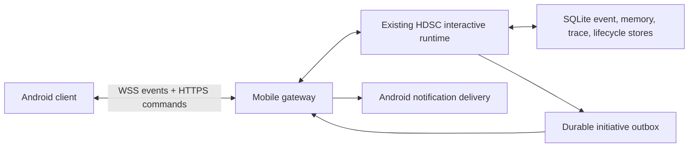

# HDSC Android Client Design

Status: proposed implementation baseline  
Date: 2026-07-27  
Scope: Android client for the existing Windows-hosted HDSC runtime

## 1. Product decision

The Android application is a companion surface for the existing digital life,
not a second independent lifeform. The Windows Python runtime remains the only
writer for identity, memories, relationship state, trace space, lifecycle jobs,
and proactive initiative. Android renders that state, streams conversations,
captures mobile input, and acknowledges delivered events.

This avoids split-brain identity, divergent memories, duplicated autonomous
loops, and hard-to-reconcile timestamps.



## 2. Experience principles

1. Conversation is the primary surface. Internal mechanics remain available
   without making the app look like an operations dashboard.
2. Presence is conveyed through time, initiative, state transitions, voice,
   and small motion. A large decorative avatar is not required for the first
   release.
3. Every claim about offline activity, memory, or identity remains inspectable
   back to persisted evidence.
4. The phone shows the same continuous timeline as the Windows TUI. Proactive
   messages are first-class messages, not a separate notification inbox.
5. Motion communicates state changes. It does not run continuously as visual
   decoration or resize layout.

## 3. Technology and component baseline

| Concern | Selection | Reason |
| --- | --- | --- |
| UI | Kotlin, Jetpack Compose, Material 3 | Native Android behavior and mature accessibility |
| Adaptive layout | Material 3 Adaptive `NavigationSuiteScaffold` | Bottom navigation on compact windows, rail on larger windows |
| List/detail | `NavigableListDetailPaneScaffold` | Single pane on phone, simultaneous list/detail on tablet |
| Navigation | Navigation Compose with typed routes | Deep links, saved state, predictable back stack |
| State | ViewModel + StateFlow, unidirectional data flow | Streaming and lifecycle state remain testable |
| Dependency injection | Hilt | Standard Android lifecycle integration |
| Network | OkHttp HTTPS/WebSocket + kotlinx.serialization | Streaming deltas and bounded reconnect control |
| Local cache | Room | Timeline, snapshot, cursor, and pending-action cache only |
| Small settings | DataStore | Endpoint, appearance, notification preferences |
| Secrets | Android Keystore | Pairing refresh credential and device key |
| Markdown | `mikepenz/multiplatform-markdown-renderer` | Native Compose Markdown and code rendering |
| Images | Coil Compose | Maintained image loading and caching |
| Audio playback | AndroidX Media3 | Streaming playback lifecycle and audio focus |
| Live voice transport | LiveKit Android, optional phase | Realtime audio/data path with Compose components |
| Lightweight animation | Compose animation APIs | State transitions and message arrival |
| Authored character motion | Lottie Compose, optional | Small avatar/status animation only |
| Deferred sync | WorkManager | Retryable outbox fetch and attachment upload |
| Active voice session | Microphone foreground service | User-visible continuous microphone/audio session |

Do not adopt a complete third-party chat UI kit. The existing event model,
tool lifecycle, proactive messages, trace evidence, and streaming behavior are
specific enough that a `LazyColumn`-based conversation is smaller and easier to
control. Use Jetchat as a reference implementation, not as a dependency.

The trace graph and voice waveform should use a bounded Compose `Canvas`.
Current general-purpose graph/waveform libraries either target ordinary charts
or have insufficient maintenance history for a core interaction.

## 4. Information architecture

Use four top-level destinations. Four is within the Material navigation range
and keeps every label visible on compact phones.

| Destination | Contents | Existing TUI mapping |
| --- | --- | --- |
| Conversation | Shared timeline, streaming reply, tools, files, voice | Conversation column and composer |
| Traces | Activated topology, trace search, node evidence | SPACE |
| Life | Current presence, organism state, relationship, goals, offline/reflection activity | STATE, RELATION, ACTIVITY |
| Memory | Long-term memory, identity evidence, corrections | MEMORY, IDENTITY |

Settings, pairing, connection diagnostics, and model information live behind
the top app bar overflow. They are not top-level destinations.

## 5. Compact phone layout

### 5.1 Conversation

```text
+------------------------------------------------+
| [avatar] Name                         [voice] [.]|
|          awake - on the Windows host            |
+------------------------------------------------+
| 08:42  She sent a message while you were away   | <- presence divider
|                                                 |
| [avatar] Assistant message rendered as Markdown |
|          [tool activity: collapsed, 2 steps]    |
|                                                 |
|                         User message bubble     |
|                                                 |
| [animated thinking/waterfall, fixed 44 dp]       |
+------------------------------------------------+
| [image.pdf x] [photo.png x]                     | <- only when queued
| [+]  Message...                    [mic] [send]  |
+------------------------------------------------+
| Conversation | Traces | Life | Memory           |
+------------------------------------------------+
```

#### Top app bar

- Height: 56 dp plus system inset.
- 36 dp identity avatar, name, and one short presence line.
- Presence examples: `在电脑上活动`, `安静休息`, `等待你的回复`,
  `上次心跳 2 分钟前`, `连接中断`.
- Voice call is a familiar phone/waveform icon. Overflow contains connection,
  pairing, theme, notification, and diagnostics commands.
- The technical model name and token counters are excluded from the default
  header; they belong in diagnostics.

#### Timeline

- Use `LazyColumn` with stable event IDs and resumable cursor pagination.
- Assistant messages are mostly unframed: avatar, author line, body, timestamp.
- User messages use a restrained right-aligned surface with an 8 dp radius.
- System/proactive events use a full-width divider row, not another chat bubble.
- Tool calls render as one collapsed inline row: `正在查天气 - 2 项完成`.
  Expanding reveals queued/running/success/failure steps and duration.
- Streaming updates the existing message item; it never appends one item per
  token. Markdown parsing is throttled to frame-safe batches.
- The thinking waterfall occupies a fixed 44 dp slot and cross-fades into the
  first text delta, preventing the timeline jump seen in the terminal UI.

#### Composer

- Anchored above the navigation bar and IME using window insets.
- Minimum height 52 dp, maximum expanded height 120 dp.
- Leading `+` opens a Material modal bottom sheet for Camera, Photo, File, PDF,
  and Scan. Use Android Photo Picker and Activity Result contracts.
- A horizontal attachment strip appears only when files are queued. Each item
  shows type icon, short name, upload state, and an icon-only remove action.
- Empty composer shows microphone; non-empty composer shows send; streaming
  shows stop. These controls have stable 48 dp touch targets.
- Slash commands remain available: typing `/` opens a suggestion sheet above
  the composer. Mobile also exposes common commands as icons and menus so slash
  syntax is not required for normal use.

### 5.2 Traces

The graph is the primary content, not a graph embedded inside a card.

```text
+-----------------------------------------------+
| Traces                         [search] [filter]|
| [Current] [Recent] [Memory] [Episode]           |
|                                               |
|             full-bleed Canvas topology         |
|       nodes, directed edges, activation pulse  |
|                                               |
| [selected node summary......................] |
+-----------------------------------------------+
```

- Reuse server-provided projection coordinates to preserve reproducibility.
- Node radius encodes bounded active mass; color encodes source/type; a ring
  encodes current activation. Direction is shown with tapered edge endpoints.
- Tap selects; drag pans; pinch zooms; double tap fits active nodes.
- Selection opens a half-height bottom sheet with content, score components,
  source timestamp, linked nodes, and evidence actions.
- Filters change visibility only. They do not mutate the underlying graph.
- Use semantic labels and a list fallback for TalkBack.

### 5.3 Life

This page reads vertically as a current condition and then an evidence timeline.
Avoid a grid of nested dashboard cards.

```text
+-----------------------------------------------+
| Life                                           |
| 13:24 - afternoon                              |
| Quiet rest                        heartbeat 24s |
|-----------------------------------------------|
| Energy       [animated battery bar]  72%        |
| Stability    [animated battery bar]  64%        |
| Openness     [animated battery bar]  58%        |
|-----------------------------------------------|
| [State] [Relationship] [Activity]              |
| timeline/list content                           |
+-----------------------------------------------+
```

- The opening band shows human time, day phase, current inner mode, Windows
  runtime connection, and last heartbeat.
- Existing battery visuals become horizontal liquid/charge bars. Animation is
  a short directional shimmer on value change, then settles.
- `State / Relationship / Activity` is a secondary segmented control, not
  three more bottom-navigation destinations.
- Relationship values use neutral language and show evidence recency. Avoid a
  single gamified affection score.
- Activity is a chronological timeline of completed offline episodes,
  artifacts, reflections, proposals, experiments, and proactive initiatives.
  Failed or skipped work is visible but visually quiet.

### 5.4 Memory

- Search field remains pinned below the app bar.
- Secondary segmented control: `Memories / Identity`.
- Memory list groups by `Today / This week / Earlier` and exposes type, source,
  confidence, and last use without card nesting.
- Selecting a memory opens a detail screen containing the stored statement,
  original event evidence, related traces, version history, and correction or
  archive actions.
- Identity shows evidence-backed beliefs with status and version. It must not
  be presented as editable profile decoration.

## 6. Medium and expanded layouts

| Window | Navigation | Content behavior |
| --- | --- | --- |
| Compact, below 600 dp | Bottom navigation | One pane; detail in route or bottom sheet |
| Medium, 600-839 dp | Navigation rail | List/detail for Memory and Life; graph + detail |
| Expanded, 840 dp and above | Navigation rail | Conversation plus persistent supporting pane |

Expanded conversation layout:

```text
+------+------------------------------+-------------------+
| nav  | conversation timeline        | current context   |
| rail |                              | presence          |
|      |                              | activated traces  |
|      | composer                     | recent activity   |
+------+------------------------------+-------------------+
```

The supporting pane uses `NavigableSupportingPaneScaffold`. It shows current
presence, the three strongest activated traces, and the latest completed
activity. It is supplementary and collapses before reducing message width.

## 7. Visual system

### Color

Use a balanced neutral base with distinct semantic accents. Do not make the app
entirely teal, purple, beige, or dark slate.

| Token | Light | Dark | Use |
| --- | --- | --- | --- |
| Background | `#F7F8F5` | `#121513` | Main canvas |
| Surface | `#FFFFFF` | `#1B201D` | Composer and raised controls |
| Ink | `#202522` | `#E7ECE8` | Primary text |
| Life | `#287A62` | `#68C3A3` | Presence, healthy state |
| Thought | `#B7791F` | `#E8B866` | Thinking, trace activation |
| Affect | `#B94F55` | `#EE8A8F` | Emotional emphasis |
| Evidence | `#3478A4` | `#75B9E4` | Sources, files, external truth |
| Error | Material error token | Material error token | Failures only |

Generate the runtime scheme through Material color roles and provide both light
and dark themes. Do not use gradients or decorative floating blobs.

### Type and shape

- Use the Android system CJK font for the initial release.
- App title 22 sp; section 18 sp; body 16 sp; metadata 12-13 sp.
- Letter spacing stays at zero.
- Surfaces and repeated items use 4-8 dp radii. Message bubbles may use an
  asymmetric 8 dp shape to indicate direction.
- Fixed icon touch targets are 48 dp. Prefer Material Symbols/Lucide-equivalent
  familiar icons over text inside rounded controls.

### Motion

- Message arrival: 180 ms fade plus 6 dp translation.
- First streamed text: cross-fade from the fixed thinking slot, 160 ms.
- Trace activation: one 420 ms ring expansion; no endless pulsing after settle.
- Battery change: 500 ms value interpolation with a short fill shimmer.
- Navigation: Material predictive-back and shared-axis transitions.
- Respect system reduced-motion and animator-duration settings.

## 8. Voice mode

Voice is a conversation mode, not a separate destination.

- Tap the voice icon to open a full-height voice sheet over the same session.
- Top: compact identity/presence.
- Center: 160-220 dp authored avatar or abstract audio-reactive mark.
- Bottom: stable waveform, live transcript, mute, speaker, interrupt, and end.
- User speech, partial ASR, model text deltas, TTS audio deltas, and interruption
  are separate event types with monotonic sequence numbers.
- Active microphone capture uses the Android microphone foreground-service type
  and a visible ongoing notification.
- LiveKit is suitable when bidirectional low-latency audio is introduced. Plain
  WebSocket remains sufficient for text and tool streaming.

## 9. Windows-to-Android gateway

Add an interface adapter beside the current TUI. It calls the same
`InteractiveSession` and snapshot services instead of duplicating business
logic.

### Pairing

1. Windows displays a QR code containing endpoint, one-time challenge, and
   server public-key fingerprint.
2. Android scans the QR and confirms the fingerprint.
3. Gateway exchanges the challenge for a device-scoped refresh credential.
4. Android stores the credential and device private key in Android Keystore.
5. All subsequent traffic uses TLS. API-provider keys never enter the APK.

Use mDNS for LAN discovery. For remote access, use a private overlay network
such as Tailscale before introducing a public relay.

### Protocol surfaces

```text
POST /mobile/v1/pair
GET  /mobile/v1/bootstrap
GET  /mobile/v1/events?after=CURSOR
GET  /mobile/v1/snapshot
POST /mobile/v1/messages
POST /mobile/v1/attachments
POST /mobile/v1/commands
WS   /mobile/v1/stream
```

WebSocket event families:

```text
connection.state
message.accepted
assistant.start | assistant.delta | assistant.done
tool.delta | tool.started | tool.output | tool.finished
initiative.delivered
snapshot.patch
trace.patch
voice.asr.partial | voice.asr.final | voice.audio.delta
error
```

Each event carries `event_id`, `conversation_id`, `sequence`, `occurred_at_ms`,
and optional `correlation_id`. Android persists the last acknowledged sequence
and resumes without duplicating visible messages.

## 10. Background behavior

- The digital-life heartbeat and autonomous loops continue on Windows.
- Android keeps a WebSocket while the app is foregrounded.
- Doze and app standby make an invisible permanent mobile socket unreliable and
  battery-expensive; do not represent it as the lifeform's heartbeat.
- Proactive messages use a minimal push wakeup or user-visible connection
  service, then fetch the durable outbox item from Windows.
- WorkManager retries missed-event fetches, upload completion, and cache cleanup.
- A foreground service is reserved for an active voice call or an explicitly
  user-enabled live connection, always with a visible notification.
- On reconnect, Android requests all events after its cursor and reconciles the
  current snapshot.

## 11. Module layout

```text
android/
  app/
  core/designsystem/
  core/model/
  core/network/
  core/database/
  core/pairing/
  core/notifications/
  core/audio/
  feature/conversation/
  feature/traces/
  feature/life/
  feature/memory/
  feature/settings/
  benchmark/
```

Keep transport DTOs separate from UI models. Repository implementations merge
Room cache state and remote stream events into stable StateFlow models.

## 12. Delivery sequence

### A0 - Design contract

- Compose theme, typography, spacing, icons, compact/expanded wireframes.
- Event protocol schema and pairing threat model.
- Screenshot baselines at 360x800, 412x915, 800x1280, and 1280x800.

### A1 - Shell and pairing

- Android module, four-destination adaptive navigation, QR pairing, secure
  credential storage, connection state, bootstrap snapshot.

### A2 - Conversation parity

- Event history, SSE/WebSocket-style deltas, Markdown, tool trail, attachments,
  slash-command suggestions, reconnect cursor, proactive messages.

### A3 - Inspectable life

- Trace Canvas and node detail, Life state/relationship/activity, Memory and
  Identity list/detail, evidence links.

### A4 - Mobile continuity

- Background notification delivery, WorkManager reconciliation, offline cache,
  notification deep links, missed-event recovery.

### A5 - Realtime voice

- Microphone permission flow, active-session foreground service, ASR/TTS stream,
  audio focus, Bluetooth routing, interruption, transcript persistence.

### A6 - Quality and release

- TalkBack, font scaling, reduced motion, predictive back, foldable postures,
  screenshot tests, Macrobenchmark, network fault injection, signed APK.

## 13. Acceptance criteria for the first usable APK

1. Pair with the Windows host by QR and reopen without pairing again.
2. Load the same conversation and proactive messages as the TUI.
3. Render streamed Markdown into one stable message item.
4. Show tool execution live and settle it after completion.
5. Send images, PDFs, and files through the existing multimodal path.
6. Inspect trace, state, relationship, memory, identity, and activity evidence.
7. Recover after Wi-Fi loss with no duplicated event.
8. Receive a proactive-message notification and deep-link to its timeline item.
9. Adapt correctly to phone portrait, landscape, tablet, and foldable widths.
10. Keep provider API keys and the authoritative HDSC database off the phone.

## 14. Researched references

- [Material 3 adaptive navigation](https://developer.android.com/develop/ui/compose/layouts/adaptive/build-adaptive-navigation)
- [Material 3 adaptive list-detail](https://developer.android.com/develop/adaptive-apps/guides/list-detail)
- [Material 3 in Compose](https://developer.android.com/develop/ui/compose/designsystems/material3)
- [Official Compose samples and Jetchat](https://github.com/android/compose-samples)
- [Compose Markdown renderer](https://github.com/mikepenz/multiplatform-markdown-renderer)
- [Coil image loading](https://github.com/coil-kt/coil)
- [LiveKit Android Compose components](https://github.com/livekit/components-android)
- [Lottie Android](https://github.com/airbnb/lottie-android)
- [Android foreground-service types](https://developer.android.com/develop/background-work/services/fgs/service-types)
- [Android Doze and app standby](https://developer.android.com/training/monitoring-device-state/doze-standby)

